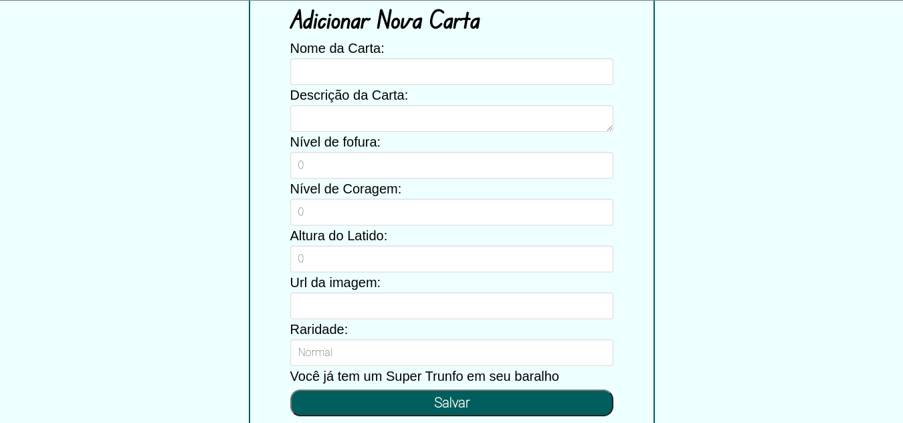
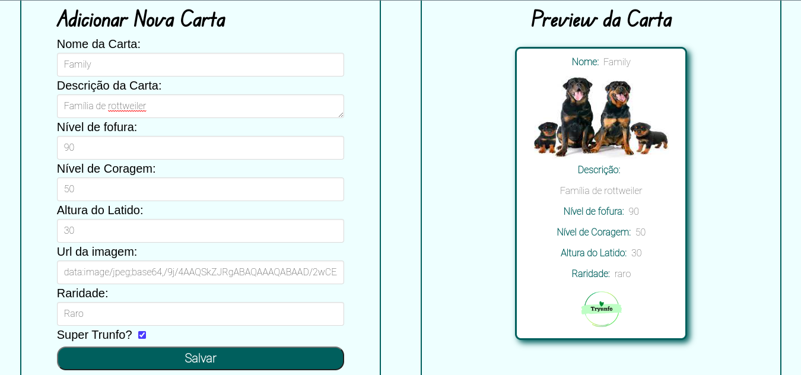
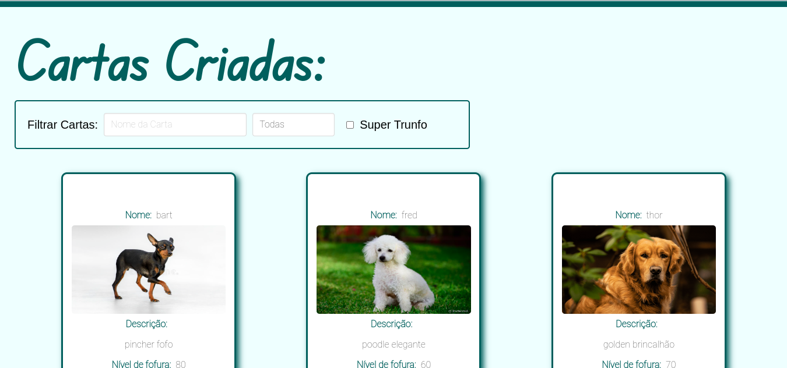
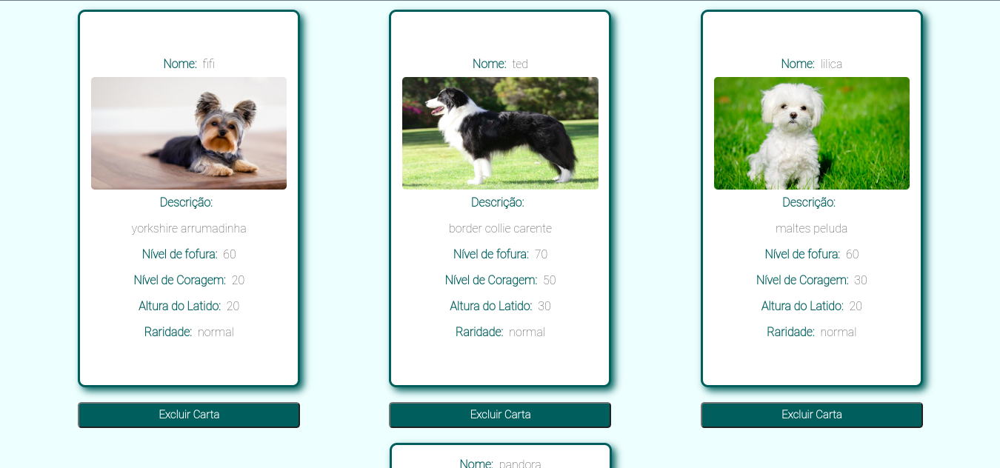

# Project Tryunfo

Este repositório contém o projeto Tryunfo desenvolvido por [Raquel G. C Würzler](https://www.linkedin.com/in/raquel-c-wurzler/) enquanto estudava na [Trybe](https://www.betrybe.com/) no módulo de FrontEnd :rocket:

_"A Trybe é uma escola do futuro para qualquer pessoa que queira melhorar de vida e construir uma carreira de sucesso em tecnologia, onde a pessoa paga quando conseguir um bom trabalho."_

#### Projeto de conclusão da seção 3, no módulo de Front-end

### Principal objetivo:
* Uma aplicação react para criar, pesquisar e excluir cartas do jogo Tryunfo (parecido com o jogo Super Trunfo).

### O que foi entregue:
<details>
  <summary>🤓</summary>
  
  <br />
  
  
  <br />
  
  
  <br />
  
  
  <br />
  
</details>

### Detalhes desse projeto:
* Projeto feito em React;
* Todo componentizado em arquivos jsx;
* Contém as seguintes componentes: Card (com os dados de cada carta), CardList (com as regras de negócio para renderizar a lista de cartas criadas), Form (formulário para cadastrar as informações de cada nova carta), Header (cabeçalho);
* Nessa aplicação é possível cadastrar uma nova carta com nome, descrição, habilidades de fofura, coragem e latido, imagem e raridade. Após salvar cada carta ela é renderizada abaixo. É possível filtrar as cartas criadas por nome, raridade e a carta Super Trunfo;
* Enquanto as informações das cartas são digitadas no formulário é possível ver um preview de como será a carta;
* Apenas uma carta da lista pode ser uma carta Super Trunfo;
* Usado o framework Bulma para auxiliar na estilização;


##### Arquivos disponibilizados pela Trybe:
* pasta public;
* .env;
* .eslintignore;
* .eslintrc.json;
* .gitignore;
* .npmrc;
* .stylelintignore;
* .stylelintrc.json;
* package-lock.json;
* package.json;

##### Link Deploy: https://guileless-brioche-47d8b9.netlify.app/

## Stack utilizada

**Front-end:** React, CSS, JSX, HTML, Bulma

## Instalação e uso

```bash
# Abra um terminal e copie este repositório com o comando
git clone git@github.com:Raquel-Wurzler/project_tryunfo.git

# Entre na pasta do projeto 
cd project_tryunfo

# Instale as dependências
yarn install
ou 
npm install

# Rode o servidor
npm start

```
